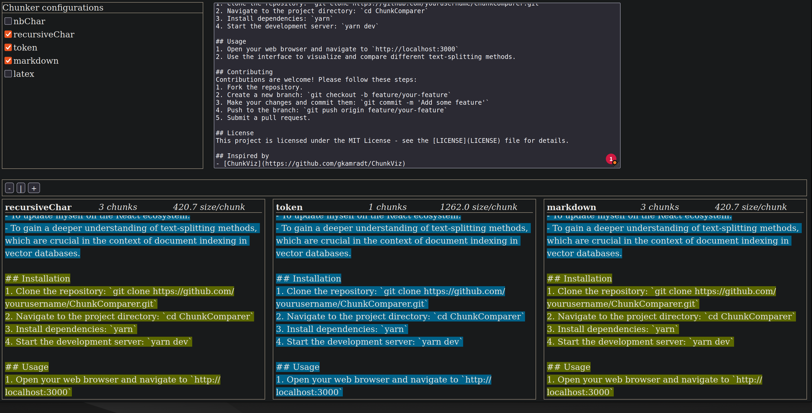

# ChunkComparer

## Description
A simple web tool to visualize and compare methods for splitting text into chunks.

## Motivation
This project serves as a learning exercise for me with two main goals:
- To update myself on the React ecosystem.
- To gain a deeper understanding of text-splitting methods, which are crucial in the context of document indexing in vector databases.

## Installation
1. Clone the repository: `git clone https://github.com/yourusername/ChunkComparer.git`
2. Navigate to the project directory: `cd ChunkComparer`
3. Install dependencies: `yarn`
4. Start the development server: `yarn dev`

## Usage
1. Open your web browser and navigate to `http://localhost:3000`
2. Use the interface to visualize and compare different text-splitting methods.

## Inspired by
- [ChunkViz](https://github.com/gkamradt/ChunkViz)
